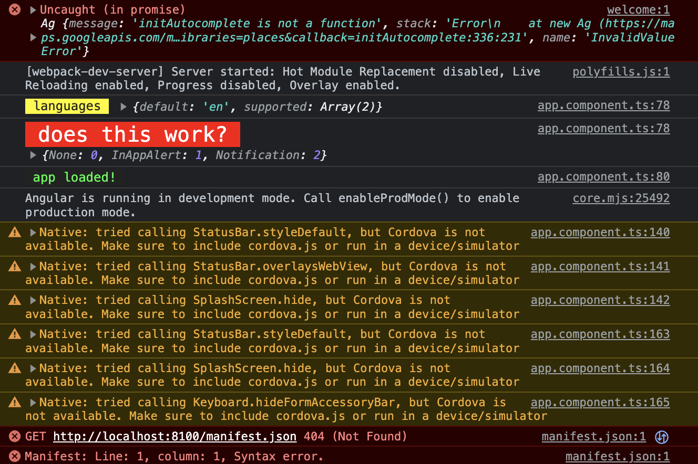

# pretty-log

## why?

For debugging in the browser console. Sometimes there are so many console.logs that you cannot see the forest cause of all the trees (that's a German saying horribly translated :P).

## let's see

```
import { L } from '@philipasdf/pretty-log';

// pass a json object with a string message
L.log(this.appConfig.languages, 'languages');

// style your log
L.r().xl().log(this.oneSignal.OSInFocusDisplayOption, 'does this work?');

// passing only a message
L.g().log('app loaded!');
```



## how?

1. I tried to make using pretty-log easy and <b>fast</b> with a chainable class.
   Get the chainable class by calling the instance 'L'. I also added more instances LL, PL and PP because sometimes L is hard to auto-import by the IDE.

```
L
LL
PL
PP
```

2. Call any chain method. Chaining multiple colors affects only one color.

```
// red
L.r()

// green
L.g()

// big font-size
L.xl()
```

3. Call log() at the end of the chain.

```
L.r().xl().log()

// per default the log text is 'test'
```

4. Shortcut. There is also an alias for log. You can call log without calling the instance L before.

```
log()
```

## other prints

For following prints you don't need the instance L. These are extra exported functions.

```
line();
tableFlip();
tableUnflip();
middleFinger();

```

For this one pass in a text.

```
asciiArt('')
```

### note for me

```
npm run build
npm publish --access public
```

ascii emoji arts are AI generated with CodePilot.
